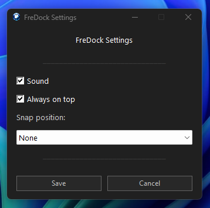

<p align="center">
  
</p>

<h1 align="center">FreDock</h1>

<p align="center">
<b>A lightweight visual clipboard launcher for Windows.</b>
</p>

<p align="center">
Lightweight • Portable • Open Source
</p>

<p align="center">

Made with ❤️ using AutoHotkey v2

Designed and maintained by <b>Xofredlum</b>

Created with the assistance of <b>ChatGPT (OpenAI)</b>

</p>

---

# ⭐ New in Version 1.3

## Visual Button Editor

FreDock now lets you edit, create and delete clipboard buttons directly from the interface.

No manual INI editing required.

Simply click **Edit**, modify your buttons, then click **✔ Done**.

---

# Why FreDock?

FreDock was born from a simple idea.

Most of us copy the same information dozens of times every day.

- Email addresses
- Passwords
- URLs
- Customer information
- Templates
- Code snippets

FreDock keeps everything just one click away.

No installation.

No cloud.

No database.

Just a lightweight companion that's always ready.

---

# Features

- ✅ Visual Button Editor (NEW)
- ✅ Unlimited configurable buttons
- ✅ Portable (no installation required)
- ✅ Automatic INI reload
- ✅ Dark user interface
- ✅ Window position memory
- ✅ Always-on-top mode
- ✅ Snap positions
- ✅ Built-in Settings dialog
- ✅ Splash screen
- ✅ Lightweight and fast

---

# Screenshots

## Main Window


---

## Visual Button Editor (NEW)


---

## Settings



---

## About


---

# Quick Start

1. Download the latest release.
2. Extract the ZIP archive.
3. Run **FreDock64.exe**.
4. Start copying smarter.

---

# Configuration

FreDock stores its configuration inside a simple INI file.

Advanced users can still edit the file manually if desired.

```ini
[Button1]
Name=Email
Text=john@example.com

[Button2]
Name=Website
Text=https://github.com
```

Changes are automatically detected and reloaded.

---

# Preferences

FreDock supports:

- Sound notifications
- Always-on-top mode
- Snap positions
- Automatic configuration reload

---

# Philosophy

FreDock is built around a simple idea.

> **Simple to use. Powerful when you need it.**

The Visual Button Editor makes FreDock accessible to everyone.

The INI file remains available for advanced users.

---

# Roadmap

Ideas currently under consideration:

- 🔍 Search
- 📂 Categories
- ⭐ Favorites
- 🔀 Drag & Drop button reordering

Suggestions are always welcome.

---

# Contributing

Bug reports, feature requests and pull requests are always welcome.

Please help keep FreDock lightweight, portable and easy to use.

---

# License

Released under the MIT License.

---

# Acknowledgements

FreDock is designed and maintained by **Xofredlum**.

Developed with the assistance of **ChatGPT (OpenAI)**.

---

<p align="center">

⭐ If you enjoy FreDock, consider giving the project a Star!

</p>
