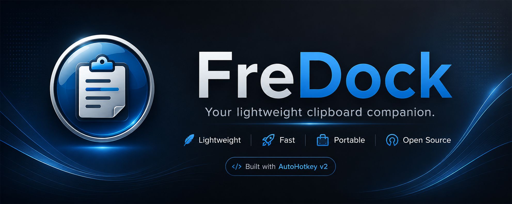
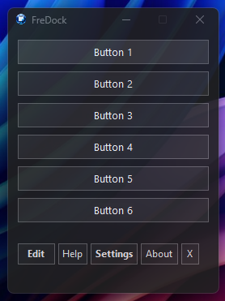
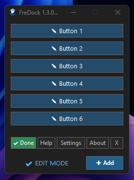
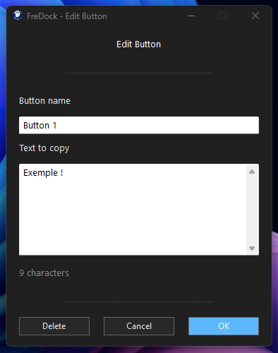
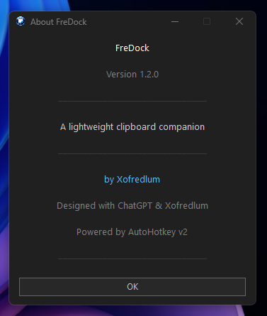

<p align="center">
  
</p>

<h1 align="center">FreDock</h1>

<p align="center">

<b>Your lightweight clipboard companion.</b>

Fast • Portable • Elegant • Open Source

</p>

---

## ✨ Why FreDock?

FreDock is a lightweight clipboard companion designed for people who frequently copy the same text every day.

No installation.

No database.

No unnecessary complexity.

Just your clipboard...

made faster.

---

## 🚀 Features

✔ Unlimited configurable buttons

✔ Visual Button Editor

✔ Dark / Light / System themes

✔ Window Transparency

✔ Premium micro-interactions

✔ Automatic INI reload

✔ Always-on-top

✔ Snap positioning

✔ Portable configuration

✔ Open Source

---

# 📸 Screenshots

## Main Window



---

## Visual Button Editor



---

## Edit Mode



---

## About



---

# ⚡ Quick Start

1. Download the latest release.

2. Extract the ZIP archive.

3. Run **FreDock64.exe** (recommended).

4. Enjoy!

---

# ⚙ Requirements

- Windows 10 / Windows 11
- No installation required

---

# ❤️ Philosophy

FreDock follows one simple principle:

> **If in doubt, keep it simple.**

Every feature should have a purpose.

Every pixel should have a reason.

Every interaction should feel effortless.

---

# 📦 Included Files

```text
FreDock64.exe
FreDock32.exe
FreDock.ini
FreDock.ico
README.md
CHANGELOG.md
LICENSE
```

---

# 🛠 Built With

- AutoHotkey v2
- GitHub
- ChatGPT

---

# ❤️ Credits

Designed and developed by **Xofredlum**

Built with the help of **ChatGPT**

---

# ⭐ Support the Project

If FreDock makes your daily workflow easier...

⭐ Star the project on GitHub!

Every star helps the project grow.

---

<p align="center">

Made with ❤️, coffee ☕ and a few virtual pizzas 🍕

</p>
