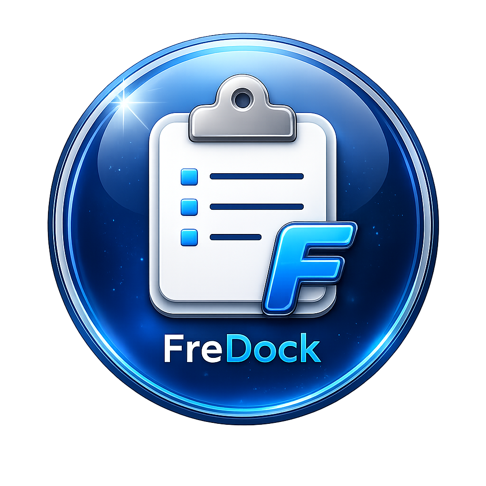

# <p align="center"> FreDock</p>

<p align="center">

</p>

<p align="center">
<b>Your lightweight clipboard companion.</b>
</p>

<p align="center">

A lightweight clipboard companion for Windows.

Made with ❤️ using AutoHotkey v2.

Designed and maintained by **Xofredlum**.

Created by **Xofredlum** with the assistance of **ChatGPT (OpenAI)**.

</p>

---

# Why FreDock?

FreDock was born from a simple idea.

Many of us copy the same pieces of text dozens of times every day:

- email addresses
- passwords
- URLs
- customer information
- templates
- code snippets

FreDock keeps your most frequently used text snippets one click away.

No installation.

No cloud.

No database.

Just a lightweight companion that is always ready.

---

# Features

✅ Unlimited configurable buttons

✅ Portable (no installation required)

✅ Automatic INI reload

✅ Unlimited clipboard entries

✅ Dark user interface

✅ Window position memory

✅ Always-on-top mode

✅ Snap window positions

✅ Built-in Settings dialog

✅ Splash screen

✅ Lightweight and fast

---

# Screenshots

## Main window


---

## Settings


---

## About


---

# Installation

Download the latest release.

Extract the ZIP archive.

Run:

```
FreDock64.exe
```

No installation required.

---

# Configuration

FreDock uses a simple INI configuration file.

Example:

```ini
[Button1]
Name=Email
Text=john@example.com

[Button2]
Name=Website
Text=https://github.com
```

Add as many buttons as you like.

FreDock detects new buttons automatically.

---

# Settings

FreDock currently supports:

- Sound notifications
- Always-on-top mode
- Snap positions
- Automatic configuration reload

---

# Project philosophy

FreDock follows a simple philosophy.

Keep things lightweight.

Keep things fast.

Keep things portable.

Do one thing…

Do it well.

---

# Roadmap

Future ideas include:

- Search
- Categories
- Favorites
- Drag & Drop editor
- Graphical button editor

Suggestions are always welcome.

---

# Contributing

Bug reports, feature requests and pull requests are welcome.

Please help keep FreDock lightweight, portable and easy to use.

---

# License

This project is released under the MIT License.

---

# Acknowledgements

FreDock is designed and maintained by **Xofredlum**.

Developed with the assistance of **ChatGPT (OpenAI)**.

---

<p align="center">

⭐ If you find FreDock useful, consider giving this project a star.

</p>
